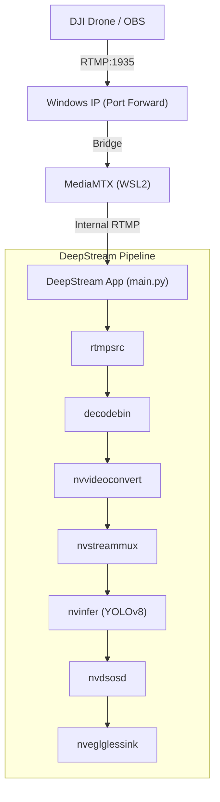

# DeepStream Drone Surveillance Pipeline


This project implements a hardware-accelerated computer vision pipeline designed for real-time RTMP ingestion from DJI drones. Optimized for **WSL2**, it uses `decodebin` for robust stream handling and NVIDIA DeepStream for zero-copy inference.

## System Architecture (WSL2)

The pipeline uses a local RTMP server (**MediaMTX**) as a bridge between the Windows network and the WSL2 DeepStream environment.



## Setup & Running

### 1. RTMP Server (WSL2)
We use MediaMTX to receive the drone feed. To start it:
```bash
cd mediamtx
./mediamtx
```

### 2. Drone Connectivity (Windows Port Forwarding)
Since WSL2 is behind NAT, you must forward port 1935 from Windows to WSL2. Run in **PowerShell (Admin)**:

```powershell
# Get your WSL2 IP first (inside WSL: ip addr show eth0)
$wsl_ip = "172.21.229.176" 

# Add Port Proxy
netsh interface portproxy add v4tov4 listenport=1935 listenaddress=0.0.0.0 connectport=1935 connectaddress=$wsl_ip

# Allow Firewall
New-NetFirewallRule -DisplayName "WSL2 RTMP" -Direction Inbound -LocalPort 1935 -Protocol TCP -Action Allow
```

### 3. Drone Configuration
Configure your DJI drone or OBS to stream to:
*   **URL:** `rtmp://<YOUR_WINDOWS_IP>:1935/live`
*   **Key:** `stream`
*   **Codec:** H.264 (H.265 requires specific RTMP extensions not supported by all demuxers).

### 4. Run DeepStream
**Important:** Ensure the drone is actively streaming (check MediaMTX logs for `is publishing`) before starting the app.
```bash
python3 main.py
```

## Technical Highlights

*   **Robust Ingestion:** Uses `decodebin` to handle delayed video headers and dynamic stream discovery.
*   **Zero-Copy:** Data remains in GPU memory from decoding to visualization.
*   **Low Latency:** Configured with `sync=False` and `live-source=1` for real-time drone control.

## Installation

### Prerequisites
*   NVIDIA Driver 535+ & WSL2 (WSLg support for display).
*   NVIDIA DeepStream SDK 6.4+.

### Setup
```bash
./setup.sh
```

## License
MIT License.