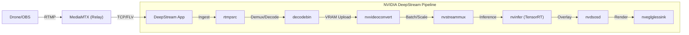

# DeepStream Drone


This project implements a hardware-accelerated computer vision pipeline designed for real-time RTMP ingestion from DJI drones. Optimized for **WSL2**, it uses `decodebin` for robust stream handling and NVIDIA DeepStream for zero-copy inference.

## System Architecture

The core of this system is a custom GStreamer pipeline utilizing NVIDIA's proprietary plugins for decoding, muxing, and inference. It ingests standard RTMP streams (via a lightweight local relay) and promotes data immediately to GPU VRAM.



## GPU Optimization Strategy

This pipeline is engineered to minimize **Host-to-Device (H2D)** and **Device-to-Host (D2H)** memory copies, which are the primary bottlenecks in high-FPS video analytics.

### 1. Memory Lifecycle (`NvBufSurface`)
*   **Ingestion (CPU):** `rtmpsrc` receives the FLV stream into system memory. `decodebin` handles the demuxing.
*   **Upload (Hybrid):** The H.264 stream is decoded. `nvvideoconvert` acts as the critical bridge, performing the **only** significant memory upload, converting raw system buffers to **NVMM (NVIDIA Memory Map)**.
*   **Processing (GPU):** Once in NVMM, the frame is encapsulated in an `NvBufSurface`. 
    *   `nvstreammux`: Batching and scaling (using dedicated hardware scalers/VIC) happens entirely in VRAM.
    *   `nvinfer`: Zero-copy pointer passing to the TensorRT engine for inference.
    *   `nvdsosd`: Uses CUDA kernels to draw bounding boxes directly on the RGBA buffer overlay, avoiding CPU rasterization.

### 2. TensorRT Inference Engine
The model is executed using NVIDIA TensorRT, which optimizes the YOLOv8 ONNX graph via:
*   **Layer Fusion:** Combining convolution, bias, and activation (CBA) layers into single kernels.
*   **Precision Calibration:** Running in **FP16** (Half-Precision) to utilize Tensor Cores on Ampere/Ada architectures, doubling throughput with negligible accuracy loss.
*   **Dynamic Batching:** Although configured for `batch-size=1` (low latency), the engine supports dynamic batch sizes for potential multi-drone scalability.

### 3. Latency Tuning
*   **`live-source=1`**: Forces `nvstreammux` to prioritize latest frames over perfect batch composition.
*   **`sync=False`**: Disables clock synchronization at the sink, allowing the pipeline to render frames as fast as inference completes, eliminating artificial buffering delays.

## Setup & Running

```bash
./setup.sh
```

### 1. RTMP Server
We use MediaMTX to receive the drone feed. To start it:
```bash
cd mediamtx
./mediamtx
```

### 2. If using WSL run:
Since WSL2 is behind NAT, you must forward port 1935 from Windows to WSL2. Run in **PowerShell (Admin)**:
```bash
netsh interface portproxy add v4tov4 listenport=1935 listenaddress=0.0.0.0 connectport=1935 connectaddress=$wsl_ip
New-NetFirewallRule -DisplayName "WSL2 RTMP" -Direction Inbound -LocalPort 1935 -Protocol TCP -Action Allow
```

### 3. Drone Configuration
Configure your DJI drone or OBS to stream to:
*   **URL:** `rtmp://<YOUR_IP>:1935/live/stream`
*   **Codec:** H.264.

### 4. Run DeepStream
**Important:** Ensure the drone is actively streaming (check MediaMTX logs for `is publishing`) before starting the app.
```bash
python3 main.py
```

## Technical Highlights

*   **NVDEC Acceleration:** Offloads H.264/H.265 decoding to dedicated silicon on the NVIDIA GPU, freeing up CPU cycles for network I/O and control logic.
*   **VIC (Video Image Compositor):** Leverages the dedicated VIC engine for high-performance color space conversion (NV12 → RGBA) and scaling, essential for preparing frames for inference without consuming CUDA cores.
*   **Dynamic Stream Management:** Implements `decodebin` with intelligent pad-linking callbacks to handle variable bitrates, delayed I-frames, and connection drops typical in wireless drone transmissions.
*   **TensorRT Custom Parsers:** Utilizes a custom C++ output parser (`libnvdsinfer_custom_impl_Yolo.so`) to decode YOLOv8 outputs directly on the GPU.

## Installation

### Prerequisites

**Hardware:**
*   NVIDIA GPU (Pascal, Turing, Ampere, Ada, or Hopper architecture).
*   x86_64 Host (Ubuntu 20.04/22.04 or Windows 11 with WSL2).

**Software:**
*   **NVIDIA Driver:** 535.xx or newer.
*   **CUDA Toolkit:** 12.x (matching the DeepStream version).
*   **NVIDIA DeepStream SDK:** 6.4 or 7.0.
*   **Python:** 3.8+ with `GObject` introspection.

**System Dependencies (Auto-installed by `setup.sh`):**
*   `gstreamer1.0-plugins-bad` (RTMP/H.264 support)
*   `gstreamer1.0-plugins-ugly` (x264 support)
*   `gstreamer1.0-libav` (FFmpeg-based decoding fallback)
*   `python3-gi`, `python3-gst-1.0` (Python bindings)
*   `libsrtp2-dev` (Streaming protocols)

## License
MIT License.
